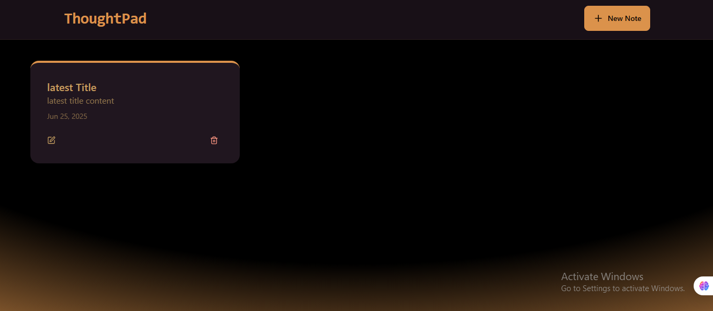

# 🧠 ThoughtPad

A clean and minimalistic full-stack notes application that allows users to create and manage their personal notes. Built with the **MERN** stack, this project demonstrates modern full-stack development using **MongoDB**, **Express**, **React (Vite)**, **Node.js**, and **Tailwind CSS**.



---

## 🚀 Features

- Create new notes with a title and content
- Modern frontend with Vite + React
- Tailwind CSS for rapid and responsive UI styling
- RESTful API built with Express.js
- MongoDB for persistent storage
- Organized project structure (frontend & backend folders)

---

## 🛠️ Tech Stack

- **Frontend**: React (Vite), Tailwind CSS
- **Backend**: Node.js, Express.js
- **Database**: MongoDB
- **Others**: Upstash Redis (for ratelimiting)

---

## 📂 Folder Structure

```
.
├── frontend/         # Vite React App
├── backend/          # Express + MongoDB Backend
├── screenshot.png
└── README.md
```

---

## ⚙️ Environment Variables

Create a `.env` file in the `backend/` directory with the following variables:

```env
MONGODB_URI=your_mongodb_connection_string
PORT=5000
NODE_ENV=development
UPSTASH_REDIS_REST_URL=your_upstash_url
UPSTASH_REDIS_REST_TOKEN=your_upstash_token
```

---

## 💻 Getting Started

### 1. Clone the repository

```bash
git clone https://github.com/Yaseeru/thoughtpad.git
cd thoughtpad
```

### 2. Install dependencies

```bash
cd backend
npm install

cd ../frontend
npm install
```

### 3. Build frontend

```bash
npm run build
```

### 4. Start the app

Make sure you're in the **root** directory:

```bash
npm run start
```

This will serve the backend and the production-ready frontend.

---

## 🔗 Live Demo

> _Coming soon..._

---

## ✍️ Author

**Abdulhamid Abdullahi Sulaiman**  
GitHub: [@Yaseeru](https://github.com/Yaseeru)

Youtube: [@abdulhamid_a__s](https://www.youtube.com/@abdulhamid_a__s)

---

## 📃 License

This project is open-source and free to use.
